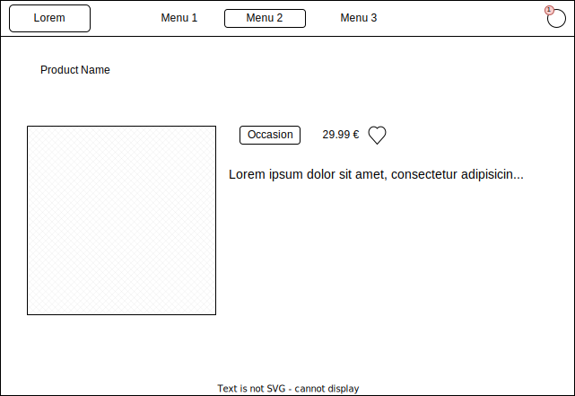

### Homepage


### Product slug



### favotiries


# React + Vite

This template provides a minimal setup to get React working in Vite with HMR and some ESLint rules.

Currently, two official plugins are available:

- [@vitejs/plugin-react](https://github.com/vitejs/vite-plugin-react/blob/main/packages/plugin-react/README.md) uses [Babel](https://babeljs.io/) for Fast Refresh
- [@vitejs/plugin-react-swc](https://github.com/vitejs/vite-plugin-react-swc) uses [SWC](https://swc.rs/) for Fast Refresh

## Getting started

Install dependencies:

```shell
yarn
```

Run the server:

```shell
yarn dev
```

Develop your feature.

Test it!

```shell
yarn test
```

Commit your changes:

```shell
yarn commit
```

Enjoy!🎉
